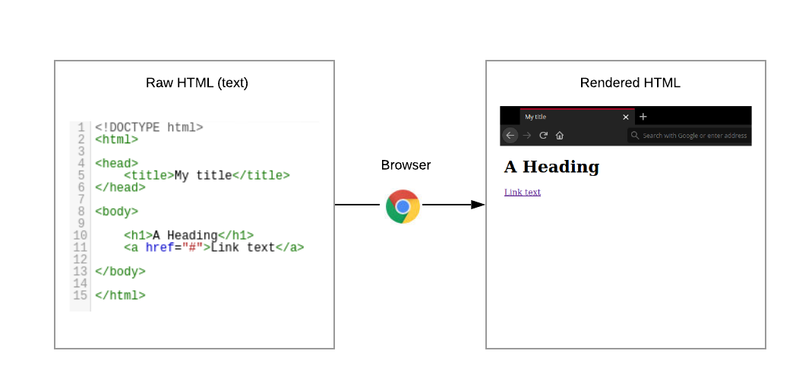

### What is web scraping?
---

Web scraping is a technique for extracting information from websites. This can be done *manually* but it is usually faster, more efficient and less error-prone to automate the task.

Web scraping allows you to acquire non-tabular or poorly structured data from websites and convert it into a usable, structured format, such as a .csv file or spreadsheet.

Scraping is about more than just acquiring data: it can also help you archive data and track changes to data online.

It is closely related to the practice of web indexing, which is what search engines like Google do when mass-analysing the Web to build their indices. But contrary to web indexing, which typically parses the entire content of a web page to make it searchable, web scraping targets specific information on the pages visited.

For example, online stores will often scour the publicly available pages of their competitors, scrape item prices, and then use this information to adjust their own prices. Another common practice is “contact scraping” in which personal information like email addresses or phone numbers is collected for marketing purposes.

### Why do we need it as a skill?
---


Web scraping is increasingly being used by academics and researchers to create data sets for text mining projects; these might be collections of journal articles or digitised texts. The practice of data journalism, in particular, relies on the ability of investigative journalists to harvest data that is not always presented or published in a form that allows analysis.

### When do we need scraping?
---

As useful as scraping is, there might be better options for the task. Choose the right (i.e. the easiest) tool for the job.

- Check whether or not you can easily copy and paste data from a site into Excel or Google Sheets. This might be quicker than scraping.
- Check if the site or service already provides an API to extract structured data. If it does, that will be a much more efficient and effective pathway. Good examples are the Facebook API, the Twitter APIs or the YouTube comments API.
- For much larger needs, Freedom of information requests can be useful. Be specific about the formats required for the data you want.

#### Challenge
---

If you had to gather data from a website which provides updated figures every 4 hours on an ongoing pandemic, would you :
- Check their terms of service
- Scrape the site directly
- Ask for permission and then scrape the site
- Use an official API (if it exists) that might have limitations

### Structured vs unstructured data
---

When presented with information, human beings are good at quickly categorizing it and extracting the data that they are interested in. For example, when we look at a magazine rack, provided the titles are written in a script that we are able to read, we can rapidly figure out the titles of the magazines, the stories they contain, the language they are written in, etc. and we can probably also easily organize them by topic, recognize those that are aimed at children, or even whether they lean toward a particular end of the political spectrum. 

Computers have a much harder time making sense of such unstructured data unless we specifically tell them what elements data is made of, for example by adding labels such as this is the title of this magazine or this is a magazine about food. Data in which individual elements are separated and labelled is said to be structured.

We see that this data has been structured for displaying purposes (it is arranged in rows inside a table) but the different elements of information are not clearly labelled.

What if we wanted to download this dataset and, for example, compare the revenues of these companies against each other or the industry that they work in? We could try copy-pasting the entire table into a spreadsheet or even manually copy-pasting the names and websites in another document, but this can quickly become impractical when faced with a large set of data. What if we wanted to collect this information for all the companies that are there?

Fortunately, there are tools to automate at least part of the process. This technique is called web scraping. From Wikipedia,

> "*Web scraping (web harvesting or web data extraction) is a computer software technique of extracting information from websites.*"

Web scraping typically targets one web site at a time to extract unstructured information and put it in a structured form for reuse.

In this lesson, we will continue exploring the examples above and try different techniques to extract the information they contain. But before we launch into web scraping proper, we need to look a bit closer at how information is organized within an HTML document and how to build queries to access a specific subset of that information.

#### Challenge
---

Which of the following would you consider to be structure and unstructured data?

A. 
```python
"The latest figures showed that webscraper INC saw a 120% increase in their revenue bringing their market cap to 2 Billion Dollars. This could be attributed to their new policies."
```

B. 
```html
<company>
    <name> webscraper INC</name>
    <revenue> 120% </revenue>
    <marketcap>2  billion </marketcap>
</company>
```

C.
```python
{ 
    'company_name' : 'webscraper INC',
    'revenue_in_%)' : 120,
    'market_cap' : '2 billion USD'
}
```

#### What is HTML?
- HTML stands for **HyperText Markup Language**
- It is the standard markup language for the webpages which make up the internet. 
- HTML contains a series of elements which make up a webpage which can connect with other webpages altogether forming a website. 
- The HTML elements are represented in tags which tell the web browser how to display the web content.

A sample raw HTML file below :

```html
<!DOCTYPE html>
<html>

<head>
    <title>My Title</title>
</head>

<body>

    <h1>A Heading</h1>
    <a href="#">Link text</a>

</body>

</html>
```

A webpage is simply a document. Every HTML element within this document corresponds to display specific content on the web browser. The following image shows the HTML code and the webpage generated (please refer to `intro_html_example.html`).


#### What is XML?
- XML stands for **eXtensible Markup Language**
- XML is a markup language much like HTML
- XML was designed to store and transport data
- XML was designed to be self-descriptive

```xml
<note>
  <date>2015-09-01</date>
  <hour>08:30</hour>
  <to>Tove</to>
  <from>Jani</from>
  <body>Don't forget me this weekend!</body>
</note>
```

### HTML DOM (or Document Object Model)
---

From the World Wide Web Consortium (W3C),
> "*The W3C Document Object Model (DOM) is a platform and language-neutral interface that allows programs and scripts to dynamically access and update the content, structure, and style of a document.*"

Everytime a web page is loaded in the browser, it creates a **D**ocument **O**bject **M**odel of the page. It essentially treats the HTML (or XML) document as a tree structure and the different HTML elements are represented as nodes and objects.

More broadly, it is a programming interface for HTML and XML documents and can be considered as the object-oriented representation of a web page which can be modified with a scripting language like JavaScript. 

It also provides us with a rich visual representation of how the different elements interact and inform us about their relative position within the tree. This helps us find and target crucial **tags**, **id** or **classes** within the document and extract the same. To sumarize, DOM is a standard which allows us to :
- **get**
- **change**
- **add**, or 
- **delete**  

HTML elements. Here we will be primarily interested in accessing and getting the data as opposed to manipulation of the document itself.

Let's look at the DOM for the HTML from our previous example below


The next question then is : How do we access the source code or DOM of **any** web page on the internet?

#### DOM inspector and `F12` to the rescue!

To inspect individual elements within a web page, we can simply use the DOM inspector (or its variants) that comes with every browser.

- Easiest way to access the source code of any web page is through the console by clicking **F12**
- Alternatively, we can right-click on a specific element in the webpage and select **inspect** or **inspect element** from the dropdown. This is especially useful in cases where we want to target a specific piece of data present within some HTML element.
- It helps highlight different attributes, properties and styles within the HTML
- It is known as **DOM inspector** and **Developers Tools** in Firefox and Chrome respectively.

> Note : Some webpages prohibit right-click and in those cases we might have to resort to inspecting the source code via F12.

A Google Chrome window along with the developer console accessed though **F12** (found under **Developers Tool**) below


### References

- https://xkcd.com/2054/
- https://developer.mozilla.org/en-US/docs/Web/API/Document_Object_Model/Introduction
- https://en.wikipedia.org/wiki/Document_Object_Model
- https://www.w3schools.com/html/
- https://www.w3schools.com/js/js_htmldom.asp
