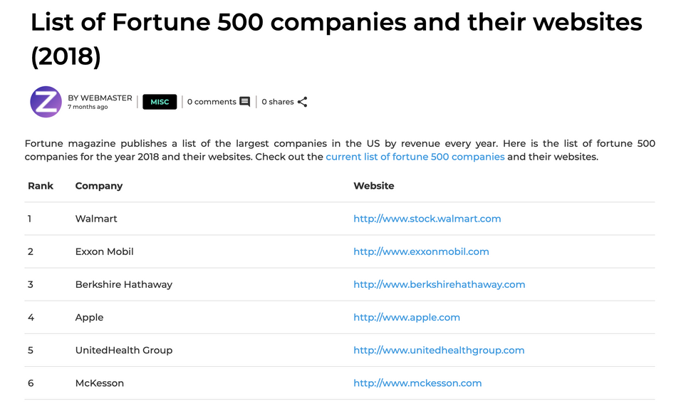

[](https://colab.research.google.com/github/MonashDataFluency/python-web-scraping/blob/master/notebooks/section-2-HTML-based-scraping.ipynb)


In this section we will look at a few HTML fundamentals to understand how web scraping works and scrape a website for structured data

### URL request and response
---

A **URL** is Uniform Resource Locator. It acts as a web address to different webpages. Every URL on the internet work on a request-response basis. The browser requests the server for a webpage and the response by the server would be the content of the webpage. This web content is then displayed on the browser.

**URL Request** - Requesting a web server for content to be viewed by the user. This request is triggered whenever you click on a link or open a webpage.

**URL Response** - A response for the request irrespective of success or failure. For every request to the web server, a mandatory response is provided by the web server and most of the times this would be the respective content requested by the URL Request.

### HTTP request, response, headers and status codes
---

Instead of the browser requesting for the content of the webpage, Python can be used for the same. A **HTTP request** to the web server can be sent with the `requests` library and the response can be examined. Typically every request receives a response with **response headers** and **status code** details.

Let us request for the web content for the Monash University front webpage with the URL - `https://www.monash.edu/`. The requests library can be used to work with webpages and web content. A request is made to get the content of the webpage with the `get()` method.


```python
import requests

monash_web_url = "https://www.monash.edu/"
response = requests.get(monash_web_url)
```

A response is received from the web server. This response will have response headers and status codes associated to that particular request.
Response headers give the detailed information about the request made to the web server.


```python
response.headers
```


    {'Content-Type': 'text/html; charset=utf-8', 'Transfer-Encoding': 'chunked', 'Connection': 'keep-alive', 'Vary': 'Accept-Encoding, Accept-Encoding', 'Cache-Control': 'max-age=0, private', 'X-Content-Type-Options': 'nosniff', 'X-Cache': 'HIT from squizedge.net', 'Pragma': 'cache', 'Age': '89', 'Server': 'openresty', 'Via': '1.1 squizedge.net', 'Date': 'Thu, 16 Jul 2020 10:09:08 GMT', 'X-upgrade-enabled': 'off', 'X-Frame-Options': 'SAMEORIGIN', 'Expires': 'Thu, 16 Jul 2020 10:39:08 GMT', 'X-Request-ID': '417b2838-f05d-49fe-912f-e2ce77294f3d', 'Content-Encoding': 'gzip'}


Every response will have a status code. The status codes indicate whether a specific HTTP request has been successfully completed.
Responses are grouped in five classes:

- Informational responses `(100–199)`
- Successful responses `(200–299)`
- Redirects `(300–399)`
- Client errors `(400–499)`
- Server errors `(500–599)`

Let us check the response status code for the HTTP request we placed


```python
response.status_code
```


    200


The response has a status code of `200`. This is a successful response and hence there should be relevant content of the webpage in the obtained response. This can be checked by printing the content. This content received is the HTML source code of the webpage.


```python
response.content[:2000] # check the end index
```


    b'<!DOCTYPE html>\n<html lang="en">\n    <head>\n        <meta charset="utf-8" />\n        <meta name="viewport" content="width=device-width, initial-scale=1.0">\n        <title>Monash University - one of the top universities in Australia</title>\n\n        <link rel="canonical" href="https://www.monash.edu" />\n        \n        \n        \r\n<!-- For iPad with high-resolution Retina display running iOS \xe2\x89\xa5 7: -->\r\n<link rel="apple-touch-icon-precomposed" sizes="152x152" href="https://www.monash.edu/__data/assets/git_bridge/0006/509343/deploy/mysource_files/favicon-152.png">\r\n\r\n<!-- For iPad with high-resolution Retina display running iOS \xe2\x89\xa4 6: -->\r\n<link rel="apple-touch-icon-precomposed" sizes="144x144" href="https://www.monash.edu/__data/assets/git_bridge/0006/509343/deploy/mysource_files/favicon-144.png">\r\n\r\n<!-- For iPhone with high-resolution Retina display running iOS \xe2\x89\xa5 7: -->\r\n<link rel="apple-touch-icon-precomposed" sizes="120x120" href="https://www.monash.edu/__data/assets/git_bridge/0006/509343/deploy/mysource_files/favicon-120.png">\r\n\r\n<!-- For iPhone with high-resolution Retina display running iOS \xe2\x89\xa4 6: -->\r\n<link rel="apple-touch-icon-precomposed" sizes="114x114" href="https://www.monash.edu/__data/assets/git_bridge/0006/509343/deploy/mysource_files/favicon-114.png">\r\n\r\n<!-- For first- and second-generation iPad: -->\r\n<link rel="apple-touch-icon-precomposed" sizes="72x72" href="https://www.monash.edu/__data/assets/git_bridge/0006/509343/deploy/mysource_files/favicon-72.png">\r\n\r\n<!-- For non-Retina iPhone, iPod Touch, and Android 2.1+ devices: -->\r\n<link rel="apple-touch-icon-precomposed" href="https://www.monash.edu/__data/assets/git_bridge/0006/509343/deploy/mysource_files/favicon-57.png">\r\n\r\n<link rel="icon" href="https://www.monash.edu/__data/assets/git_bridge/0006/509343/deploy/mysource_files/favicon.ico">\r\n<!--[if IE]><link rel="shortcut icon" type="image/x-icon" href="https://www.monash.edu/__data/assets/git_bridge/0006/509343/deploy/mysource_files/favico'


This text which looks very gibberish actually has a structure underneath. This can be observed if printed on a HTML editor.
```html
<!DOCTYPE html>\n
<html lang="en">\n

<head>\n
    <meta charset="utf-8" />\n
    <meta name="viewport" content="width=device-width, initial-scale=1.0">\n
    <title>Monash University - one of the top universities in Australia</title>\n\n
    <link rel="canonical" href="https://www.monash.edu" />\n \n \n \r\n
    <!-- For iPad with high-resolution Retina display running iOS \xe2\x89\xa5 7: -->\r\n
    <link rel="apple-touch-icon-precomposed" sizes="152x152" href="https://www.monash.edu/__data/assets/git_bridge/0006/509343/deploy/mysource_files/favicon-152.png">\r\n\r\n
    <!-- For iPad with high-resolution Retina display running iOS \xe2\x89\xa4 6: -->\r\n
    <link rel="apple-touch-icon-precomposed" sizes="144x144" href="https://www.monash.edu/__data/assets/git_bridge/0006/509343/deploy/mysource_files/favicon-144.png">\r\n\r\n
    <!-- For iPhone with high-resolution Retina display running iOS \xe2\x89\xa5 7: -->\r\n
    <link rel="apple-touch-icon-precomposed" sizes="120x120" href="https://www.monash.edu/__data/assets/git_bridge/0006/509343/deploy/mysource_files/favicon-120.png">\r\n\r\n
    <!-- For iPhone with high-resolution Retina display running iOS \xe2\x89\xa4 6: -->\r\n
    <link rel="apple-touch-icon-precomposed" sizes="114x114" href="https://www.monash.edu/__data/assets/git_bridge/0006/509343/deploy/mysource_files/favicon-114.png">\r\n\r\n
    <!-- For first- and second-generation iPad: -->\r\n
    <link rel="apple-touch-icon-precomposed" sizes="72x72" href="https://www.monash.edu/__data/assets/git_bridge/0006/509343/deploy/mysource_files/favicon-72.png">\r\n\r\n
    <!-- For non-Retina iPhone, iPod Touch, and Android 2.1+ devices: -->\r\n
    <link rel="apple-touch-icon-precomposed" href="https://www.monash.edu/__data/assets/git_bridge/0006/509343/deploy/mysource_files/favicon-57.png">\r\n\r\n
    <link rel="icon" href="https://www.monash.edu/__data/assets/git_bridge/0006/509343/deploy/mysource_files/favicon.ico">\r\n
    <!--[if IE]><link rel="shortcut icon" type="image/x-icon" href="https://www.monash.edu/__data/assets/git_bridge/0006/509343/deploy/mysource_files/favico

```

### GET and POST calls to retrieve response
---


There are mainly two types of requests which can be made to the web server. A GET request/call or a POST request/call.

**GET call** - GET is used to request data from a specified source. They are one of the most common HTTP requests. They are usually used to only receive content from the web server. An example would be to receive the content of the complete webpage.

**POST call** - POST is used to send data in the URL request to either update details or request specific content from the web server. In a POST call, data is sent and then a response can be expected from the web server. An example would be to request content from a web server based on a particular selection from a drop-down menu. The selection option is upadted while also respective content is sent back.

### Scraping a webpage
---

Let us now scrape a **list of the fotune 500 companies for the year 2018**. The website from which the data is to be scraped is [this](https://www.zyxware.com/articles/5914/list-of-fortune-500-companies-and-their-websites-2018).



It can be seen on this website that the list contains the rank, company name and the website of the company. The whole content of this website can be received as a response when requested with the request library in Python


```python
import requests
import pandas as pd
from bs4 import BeautifulSoup

web_url = 'https://www.zyxware.com/articles/5914/list-of-fortune-500-companies-and-their-websites-2018'
response = requests.get(web_url)

print('Status code\n', response.status_code)
print('\n--\n')
print('Content of the website\n', response.content[:2000])
```

    Status code
     200
    
    --
    
    Content of the website
     b'<!DOCTYPE html>\n<html lang="en" dir="ltr" prefix="content: http://purl.org/rss/1.0/modules/content/  dc: http://purl.org/dc/terms/  foaf: http://xmlns.com/foaf/0.1/  og: http://ogp.me/ns#  rdfs: http://www.w3.org/2000/01/rdf-schema#  schema: http://schema.org/  sioc: http://rdfs.org/sioc/ns#  sioct: http://rdfs.org/sioc/types#  skos: http://www.w3.org/2004/02/skos/core#  xsd: http://www.w3.org/2001/XMLSchema# ">\n  <head>\n    <meta charset="utf-8" />\n<script>dataLayer = [];dataLayer.push({"tag": "5914"});</script>\n<script>window.dataLayer = window.dataLayer || []; window.dataLayer.push({"drupalLanguage":"en","drupalCountry":"IN","siteName":"Zyxware Technologies","entityCreated":"1562300185","entityLangcode":"en","entityStatus":"1","entityUid":"1","entityUuid":"6fdfb477-ce5d-4081-9010-3afd9260cdf7","entityVid":"15541","entityName":"webmaster","entityType":"node","entityBundle":"story","entityId":"5914","entityTitle":"List of Fortune 500 companies and their websites (2018)","entityTaxonomy":{"vocabulary_2":"Business Insight, Fortune 500, Drupal Insight, Marketing Resources"},"userUid":0});</script>\n<script async src="https://www.googletagmanager.com/gtag/js?id=UA-1488254-2"></script>\n<script>window.google_analytics_uacct = "UA-1488254-2";window.dataLayer = window.dataLayer || [];function gtag(){dataLayer.push(arguments)};gtag("js", new Date());window[\'GoogleAnalyticsObject\'] = \'ga\';\r\n  window[\'ga\'] = window[\'ga\'] || function() {\r\n    (window[\'ga\'].q = window[\'ga\'].q || []).push(arguments)\r\n  };\r\nga("set", "dimension2", window.analytics_manager_node_age);\r\nga("set", "dimension3", window.analytics_manager_node_author);gtag("config", "UA-1488254-2", {"groups":"default","anonymize_ip":true,"page_path":location.pathname + location.search + location.hash,"link_attribution":true,"allow_ad_personalization_signals":false});</script>\n<script>(function(w,d,t,u,n,a,m){w[\'MauticTrackingObject\']=n;w[n]=w[n]||function(){(w[n].q=w[n].q||[]).push(arguments)},a=d.createElement(t),m=d.ge'
    

This text when formatted looks like this,

```html
<!DOCTYPE html>\n
<html lang="en" dir="ltr" prefix="content: http://purl.org/rss/1.0/modules/content/  dc: http://purl.org/dc/terms/  foaf: http://xmlns.com/foaf/0.1/  og: http://ogp.me/ns#  rdfs: http://www.w3.org/2000/01/rdf-schema#  schema: http://schema.org/  sioc: http://rdfs.org/sioc/ns#  sioct: http://rdfs.org/sioc/types#  skos: http://www.w3.org/2004/02/skos/core#  xsd: http://www.w3.org/2001/XMLSchema# ">\n

<head>\n
    <meta charset="utf-8" />\n
    <script>
        dataLayer = [];
        dataLayer.push({
            "tag": "5914"
        });
    </script>\n
    <script>
        window.dataLayer = window.dataLayer || [];
        window.dataLayer.push({
            "drupalLanguage": "en",
            "drupalCountry": "IN",
            "siteName": "Zyxware Technologies",
            "entityCreated": "1562300185",
            "entityLangcode": "en",
            "entityStatus": "1",
            "entityUid": "1",
            "entityUuid": "6fdfb477-ce5d-4081-9010-3afd9260cdf7",
            "entityVid": "15541",
            "entityName": "webmaster",
            "entityType": "node",
            "entityBundle": "story",
            "entityId": "5914",
            "entityTitle": "List of Fortune 500 companies and their websites (2018)",
            "entityTaxonomy": {
                "vocabulary_2": "Business Insight, Fortune 500, Drupal Insight, Marketing Resources"
            },
            "userUid": 0
        });
    </script>\n
    <script async src="https://www.googletagmanager.com/gtag/js?id=UA-1488254-2"></script>\n
    <script>
        window.google_analytics_uacct = "UA-1488254-2";
        window.dataLayer = window.dataLayer || [];

        function gtag() {
            dataLayer.push(arguments)
        };
        gtag("js", new Date());
        window[\'GoogleAnalyticsObject\'] = \'ga\';\r\n  window[\'ga\'] = window[\'ga\'] || function() {\r\n    (window[\'ga\'].q = window[\'ga\'].q || []).push(arguments)\r\n  };\r\nga("set", "dimension2", window.analytics_manager_node_age);\r\nga("set", "dimension3", window.analytics_manager_node_author);gtag("config", "UA-1488254-2", {"groups":"default","anonymize_ip":true,"page_path":location.pathname + location.search + location.hash,"link_attribution":true,"allow_ad_personalization_signals":false});
    </script>\n
    <meta name="title" content="List of Fortune 500 companies and their websites (2018) | Zyxware Technologies" />
    
    .. and so on
```

> Note : It is always a good idea to "prettify" HTML, XML or JSON strings for visual clarity.

### Parsing HTML and accessing different elements
---

`bs4` is a Python library which parses through HTML content and understands the complete structure of the content. The response content can be passed to a `BeautifulSoup()` method to obtain a soup object which looks very structured.


```python
soup_object = BeautifulSoup(response.content)

# Uncomment the below line and look into the contents of soup_object
# soup_object
```

### Explore the schema: Manipulating it into a tabular structure
---
To be able to accurately extract relevant data from the webpage, it is important to explore the schema and understand the structure of the webpage. A good way to do this is to inspect the webpage directly on a web browser.
<br>

To do this,
- Open the webpage on a browser
- Right click on the data content to be extracted
- Click on `Inspect` or `Inspect element` option

This will open a console window which shows the real time HTML code corresponding to the web content. Now identify the type of HTML tag which contains all the data along with any id names or class names associated to that HTML tag. In our case, the data is enclosed in the `<table>` HTML tag with the class name `'data-table'`. This information can be used to search for the web content directly in our soup object with the `find_all()` method. This will return a soup object.


```python
data_table = soup_object.find_all('table', 'data-table')[0]

# Uncomment the below line and look into the contents of data_table
# data_table
```

It can be seen that relevant block of data has been extracted but further extracted needs to be done to individually extract the rank, company name and the company website data. On further analysis, it can be seen that every row of data is enclosed under a `<tr>` HTML tag which means `table row`. All these row values can be extracted into a list of values by finding the `<tr>` values from our newly created soup object `data_table`.


```python
all_values = data_table.find_all('tr')
all_values[:10] # Prints the first 10 captured tag elements
```


    [<tr><th>Rank</th>
     <th>Company</th>
     <th>Website</th>
     </tr>, <tr><td>1</td>
     <td>Walmart</td>
     <td><a href="http://www.stock.walmart.com">http://www.stock.walmart.com</a></td>
     </tr>, <tr><td>2</td>
     <td>Exxon Mobil</td>
     <td><a href="http://www.exxonmobil.com">http://www.exxonmobil.com</a></td>
     </tr>, <tr><td>3</td>
     <td>Berkshire Hathaway</td>
     <td><a href="http://www.berkshirehathaway.com">http://www.berkshirehathaway.com</a></td>
     </tr>, <tr><td>4</td>
     <td>Apple</td>
     <td><a href="http://www.apple.com">http://www.apple.com</a></td>
     </tr>, <tr><td>5</td>
     <td>UnitedHealth Group</td>
     <td><a href="http://www.unitedhealthgroup.com">http://www.unitedhealthgroup.com</a></td>
     </tr>, <tr><td>6</td>
     <td>McKesson</td>
     <td><a href="http://www.mckesson.com">http://www.mckesson.com</a></td>
     </tr>, <tr><td>7</td>
     <td>CVS Health</td>
     <td><a href="http://www.cvshealth.com">http://www.cvshealth.com</a></td>
     </tr>, <tr><td>8</td>
     <td>Amazon.com</td>
     <td><a href="http://www.amazon.com">http://www.amazon.com</a></td>
     </tr>, <tr><td>9</td>
     <td>AT&amp;T</td>
     <td><a href="http://www.att.com">http://www.att.com</a></td>
     </tr>]


```python
print(all_values[0])
print('--')
print(all_values[1])
print('--')
print(all_values[2])
```

    <tr><th>Rank</th>
    <th>Company</th>
    <th>Website</th>
    </tr>
    --
    <tr><td>1</td>
    <td>Walmart</td>
    <td><a href="http://www.stock.walmart.com">http://www.stock.walmart.com</a></td>
    </tr>
    --
    <tr><td>2</td>
    <td>Exxon Mobil</td>
    <td><a href="http://www.exxonmobil.com">http://www.exxonmobil.com</a></td>
    </tr>
    

#### Challenge
---
 Explore the schema further, extract the column names which are located in the first row and print them.
 
 ---

The first element of the list contains the column names 'Rank, Company and Website'. The next elements of the list contain soup objects which contain the company data including the rank. This data can be extracted in a loop since the structure for all the list elements is the same.

- An empty dataframe `fortune_500_df` is created with the column names `rank`, `company_name` and `company_website`
- The index is initiated to zero
- A for loop is designed to go through all the elements of the list in order and extract the rank, company name and company website from the list element which are enclosed in the `<td>` HTML tag. A `find_all()` will return a list of td tags.
- The `.text` attribute can be used to just pick the text part from the tag. In our case this is the rank, company name and the company website
- These values are then put into the dataframe and the index value is incremented


```python
fortune_500_df = pd.DataFrame(columns = ['rank', 'company_name', 'company_website']) # Create an empty dataframe
ix = 0 # Initialise index to zero

for row in all_values[1:]:
    values = row.find_all('td') # Extract all elements with tag <td>
    # Pick only the text part from the <td> tag
    rank = values[0].text
    company = values[1].text
    website = values[2].text
    
    fortune_500_df.loc[ix] = [rank, company, website] # Store it in the dataframe as a row
    ix += 1
    
# Print the first 5 rows of the dataframe
fortune_500_df.head()
```

|    |   rank | company_name       | company_website                  |
|---:|-------:|:-------------------|:---------------------------------|
|  0 |      1 | Walmart            | http://www.stock.walmart.com     |
|  1 |      2 | Exxon Mobil        | http://www.exxonmobil.com        |
|  2 |      3 | Berkshire Hathaway | http://www.berkshirehathaway.com |
|  3 |      4 | Apple              | http://www.apple.com             |
|  4 |      5 | UnitedHealth Group | http://www.unitedhealthgroup.com |


### Store it in the appropriate format
---

The dataframe can now be stored as a csv file. Pandas has a `to_csv` method which can be used to save the data into the file.


```python
fortune_500_df.to_csv('fortune_500_companies.csv', index=False)
```
